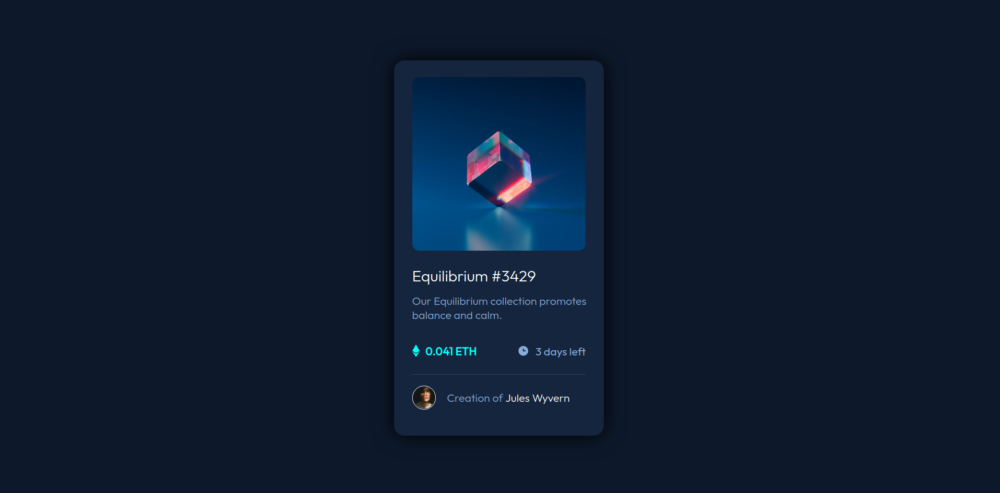

# Frontend Mentor - NFT preview card component

This is a solution to the [NFT preview card component](https://www.frontendmentor.io/challenges/nft-preview-card-component-SbdUL_w0U). Frontend Mentor challenges help you improve your coding skills by building realistic projects. 

## Table of contents

  - [Screenshot](#screenshot)
  - [Links](#links)
  - [Built with](#built-with)
  - [What I learned](#what-i-learned)
  - [Continued development](#continued-development)
  - [Useful resources](#useful-resources)
  - [Author](#author)


### Screenshot




### Links

- Solution URL: [Solution](https://github.com/hamees-sayed/nft-card-component)
- Live Site URL: [Live site URL](https://nft-card-2510.netlify.app/)

### Built with

- HTML5
- CSS3

### What I learned

To overlay an image over another image: 

```css
.overlay {                      // overall image that we want to overlay with backgroun colour and opacity
    position: absolute;
    width: 250px;
    height: 250px;
    border-radius: 10px;
    top: 24px;
    opacity: 0;                                 // important property
    background: hsl(178, 100%, 50%, 0.5);;
}

.overlay img {                  // positioning the icon on the overlay image (if any)
    position: absolute;
    width: 45px;
    height: 45px;
    top: 50%;
    left: 50%;
    transform: translate(-50%, -50%);
} 

.overlay:hover {                        // main overlay mechanism element
    opacity: 5;
    transition: 0.099s ease 0s;
    cursor: pointer;
} 
```

### Continued development

I'll probably next work to make this site responsive.


### Useful resources

- [W3 Schools](https://www.w3schools.com) 

## Author

- Frontend Mentor - [@hamees-sayed](https://www.frontendmentor.io/profile/hamees-sayed)
- Twitter - [@HameesSayed2](https://www.twitter.com/HameesSayed2)